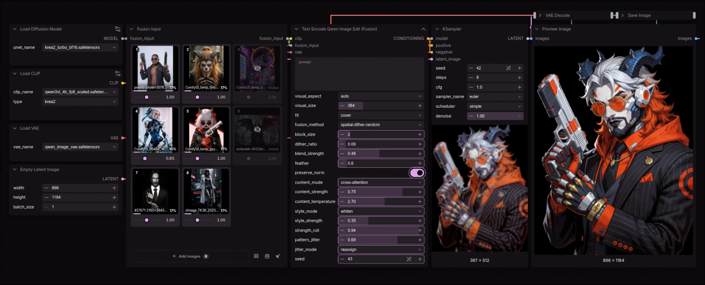
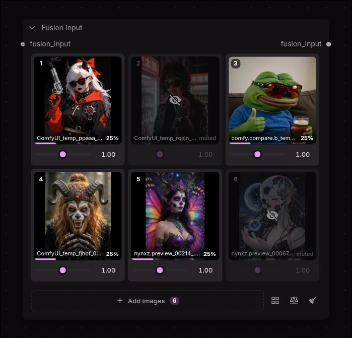
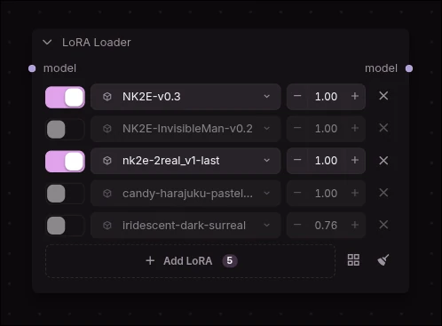

# Nynx'z Experimental Nodes

Experimental ComfyUI nodes — the stuff that's still moving. Node ids, schemas and
behaviour here can change between commits. For the settled ones, see
[Nynx'z Custom Nodes](https://github.com/nynxz-dev/ComfyUI-NynxzNodes).


## Nodes at a glance

| Group | Nodes |
| --- | --- |
| [**Fusion**](#fusion--nynxzfusion) — `Nynxz/Fusion` | Fusion Input · Fusion Images · Text Encode Qwen Image Edit (Fusion) |
| [**Conditioning**](#conditioning--nynxzconditioning) — `Nynxz/Conditioning` | Conditioning Blend (Mixer) · Conditioning Sigma Gate · Conditioning Variation |
| [**LoRA**](#lora--nynxzlora) — `Nynxz/LoRA` | LoRA Loader · LoRA Loader (CLIP) · LoRA Picker · Apply LoRA |

## Nodes

### Fusion — `Nynxz/Fusion`

Spatial visual-token fusion for Qwen3-VL image editing. Each source image is encoded
independently, then their **visual** conditioning tokens are blended on a shared spatial
grid — so a single edit can draw on many reference images at once, and you control how
much each one gets a say.

The spatial interleave underneath — hard-assigning grid cells to sources in a
checkerboard/block pattern — is [silveroxides'](https://github.com/silveroxides/ComfyUI-UtilsCollection)
original idea and implementation. What this pack adds on top: a soft weight field with
feathering, content-derived weights, per-source relative strength, style release, seeded
variety, and the on-node grid UI.


<!-- SCREENSHOT: docs/images/fusion-before-after.webp — same prompt/seed, one reference vs three fused, side by side

-->

| Node | What it does |
| --- | --- |
| **Fusion Input** | The image grid, for files on disk. Drop images on it, weight each one, mute, reorder, remove. Outputs `fusion_input`. |
| **Fusion Images** | The wire side. Autogrow IMAGE sockets, each with its own strength, fit and mute. Outputs `fusion_input`. |
| **Text Encode Qwen Image Edit (Fusion)** | Takes a `fusion_input` plus your prompt and fuses it all into one conditioning. |

Wire it up as: `Fusion Input → Text Encode Qwen Image Edit (Fusion) → KSampler`.

**Two collectors, split by where your images live** — files on disk (the grid) or a wire
(Fusion Images). They emit the same `fusion_input` and carry the same per-source controls, so
pick whichever matches how the images arrive and chain them freely in either direction.

**One image is a valid fusion.** The blend is then a passthrough, which is what you want when
you're using the node for style release (below) or just as a single-reference encode. Both
collectors and the encode node accept a single source.

#### Fusion Input



- **Drop images** anywhere on the node, or **Add images** / **Browse** to pick from your
  `input/`, `output/` or `temp/` folders. An image that's **already in `input/` is referenced,
  not re-uploaded** (matched by name + size), so dropping the same file twice never copies it
  into `input/` — only genuinely new images are uploaded.
- **Strength** is *relative prevalence*, not an absolute gain. Doubling everything changes
  nothing; halving one image hands its share of each token to whoever else contributes
  there. The `%` under each card is its real share of the result, live.
- **Mute** (the eye) drops an image from the blend without removing it.
- **Order matters.** The spatial patterns assign grid cells by source index, so image 1 and
  image 2 land in different cells. Drag a thumbnail to reorder.
- **Fit is per card** — the frame icon in each card's corner cycles `contain` (whole image,
  letterboxed — the default), `cover` (center-crop to fill) and `stretch` (distort to fill).
  The thumbnail mirrors the choice, so what you see on the card is exactly what the encoder
  gets. Force one mode for every source with the encode node's `fit` override.
- Chain **Fusion Input → Fusion Input** to group sources across several grids.
- Images are files on disk, not sockets — that's what lets every card show a real thumbnail
  and carry a visible weight. To fuse something generated upstream, run it through a Preview
  or Save node and pick it out of `temp/` or `output/`.

#### Fusion Images

<!-- SCREENSHOT: docs/images/fusion-images.webp — 3 Load Image nodes wired in, rows showing uneven strengths, one muted, mixed fits

-->

The wire-side collector. The grid only reaches files on disk; this takes any IMAGE, so
anything generated upstream (a sampler, a mask composite) can be a reference without a round
trip through `temp/`.

```
Load Image ─┐
Load Image ─┼─→ Fusion Images ─→ Text Encode ... (Fusion)
Load Image ─┘   (autogrow sockets)
```

- **Autogrow sockets** — a new IMAGE input appears as you fill them, up to 16.
- **A row per connected socket**, each with the same controls a grid card carries: a
  **strength** (the same relative prevalence), a **fit** (`contain`/`cover`/`stretch`), a
  **mute**, and the live **`%`** share of the result that source claims.
- **Rows map to sockets positionally** — the first row drives the first connected input. Wiring
  a new image in adds a row at full strength; unwiring one drops its row.
- **Muting drops the source from the blend entirely**, so the spatial patterns reflow across
  the sources that remain rather than leaving its cells empty.
- **Socket order is source order**, matching how the grid orders its cards, so it decides which
  grid cells each image gets.
- A **batched IMAGE adds one source per frame**, all sharing that socket's strength and fit.
- An optional upstream `fusion_input` is **prepended**, so a grid can feed this and vice versa.

> Per-source strength lives in a widget rather than on the sockets because a ComfyUI autogrow
> template takes exactly one input per repeat — there's no way to pair each `image_N` with its
> own strength field.

#### Text Encode Qwen Image Edit (Fusion)

Holds the prompt and the tuning:

| Knob | Does |
| --- | --- |
| `visual_aspect` / `visual_size` | The shared grid every source is fitted into. `auto` takes the aspect from the first image; set it explicitly if a portrait first image is letterboxing your landscapes too hard. Bigger `visual_size` = more visual tokens = finer fusion, more compute. |
| `fit` | How sources are framed into the grid. `per image` honours each grid card / Fusion Images row; `cover` / `contain` / `stretch` force one mode for all. **`cover`** gives the old center-crop framing the pack used before fit was a choice. |
| `strength_roll` | **More variety from the same images.** Seed-driven random re-weighting of the blend — shifts which image dominates each run. The one that actually moves the mix. `0` = off. See below. |
| `pattern_jitter` | Subtler spatial variety: reassigns a fraction of grid cells to a different image by seed. Rearranges the same tokens rather than re-weighting them, so it moves the result less. `0` = the clean pattern (default). |
| `fusion_method` | How cells are handed out: `spatial-checkerboard`, `spatial-block-interleave` (see `block_size`), `spatial-dither-random` (see `dither_ratio` + `seed`). |
| `blend_strength` | `0.0` = hard per-cell mosaic (original behaviour) → `1.0` = fully feathered. |
| `feather` | Gaussian softening, in grid cells, of each source's territory. |
| `preserve_norm` | Rescales blended tokens to keep embedding magnitude, so blends don't wash out. |
| `content_mode` / `content_strength` / `content_temperature` | Derive weights from the tokens themselves instead of geometry alone: `saliency` (foreground wins), `energy` (strongest signal wins), `cross-attention` (agreement with the per-cell consensus — smoother). |
| `style_mode` / `style_strength` | **Experimental.** Loosen the reference's grip on style so the prompt/LoRA can set the look. Off by default. See below. |

Order of operations: geometry → content → per-image strength → renormalize per token → blend
→ style release. Strength is applied last of the *weights*, so it re-weights whatever geometry
and content settled on; style release then acts on the blended tokens, never on who
contributed them.

##### Style release — `style_mode` / `style_strength`

For the anime→photoreal case: the style is supposed to come from your prompt and a LoRA (a
`2real`-style one), but the reference image's visual tokens keep voting for the look it
already *has*, and they're strong. Turning the whole block down would cost you the structure
too. Style release instead splits the tokens the AdaIN way — per-channel statistics across the
block are the *look*, each token's normalized residual is *what's where* — and flattens only
the former. Measured on realistic token statistics, both modes retain the content structure
exactly (correlation `+1.0000` against the original structure) while erasing the signature:

| `style_mode` | Removes | Leaves |
| --- | --- | --- |
| `gist` | the block's mean token — its overall "look" | per-channel scale (anisotropy). Gentler. |
| `whiten` | mean **and** per-channel scale — the full AdaIN signature | per-token structure only. Stronger. |

- **`style_strength` 0 is an exact no-op** and the default, so every existing workflow is
  bit-for-bit unchanged. Start around **0.3–0.5**.
- High values push tokens away from what the encoder normally emits, so expect it to fall
  apart near 1.0 — that's the trade, not a bug.
- It is a *hypothesis*, tested for its math and its no-op guarantees but not for whether it
  makes your generations better. That part needs your eyes and an A/B at a fixed seed.

##### Variety from the same images — `strength_roll` and `pattern_jitter`

The fusion is otherwise deterministic — identical images always fuse the same way (only
`spatial-dither-random` reads the seed). Two seed-driven knobs re-roll it, both off at `0` so
existing workflows are bit-for-bit unchanged, both driven by the same `seed` widget that
auto-increments after every run. So raise one, queue repeatedly, and each run differs.

There's a real difference in *how much* they move the result, and it's structural, not a
matter of magnitude:

- **`strength_roll`** randomly re-weights the blend each run — it shifts *which reference
  dominates the mix*. That's a change to the blend proportions, which the renormalize carries
  all the way through, so it's the one that visibly re-rolls the output. Multiplicative and
  log-symmetric (a source is as likely to be pushed up as down), bounded to ¼×–4× at `1.0`;
  muted images stay muted. Try **~0.5**.
- **`pattern_jitter`** rearranges *which cell* each image owns. It shuffles the same visual
  tokens spatially rather than re-weighting them, and the model integrates over the whole
  block, so it moves the result much less — useful for subtle spatial variation, not big
  swings. Works on any `fusion_method`.

Both are verified for their math and their no-op guarantees (0 = exact no-op, seed-tracking,
bounded, muted-stays-muted). Whether the variety *feels* right — and a good default value —
is yours to judge on real generations; the honest lever for big swings is `strength_roll`.

### Conditioning — `Nynxz/Conditioning`

Composable primitives that act on any CONDITIONING wire — a CLIP encode, a Fusion encode,
anything upstream. They stack: blend two prompts, gate the result to the back half of the
denoise, nudge it with a variation seed.

| Node | What it does |
| --- | --- |
| **Conditioning Sigma Gate** | Restrict a conditioning to a slice of sampling — in denoise percent or in real sigma. |
| **Conditioning Variation** | A "variation seed" for conditioning: seeded noise nudges the prompt without touching the sampler seed. |

#### Conditioning Sigma Gate

Drop it on a wire to make that conditioning active only within a slice of the denoise.

- **`denoise percent`** — a plain 0..1 fraction (`0` = first step, `1` = last). No model needed.
- **`sigma`** — a real sigma window. Conditioning can only store a percent range, so sigma is
  converted using the model's own schedule (**exact**, wire `MODEL`) or a wired `SIGMAS`
  schedule as a lookup table (**approximate** — fine for normal schedulers, soft for
  Karras/exponential, which are non-linear in percent).

The gate **intersects** any range already on the conditioning rather than overwriting it, so
gates stack — and it composes with the Mixer's ramp instead of fighting it.

#### Conditioning Variation

Explore neighbouring variations of the same prompt without changing the sampler seed. Noise is
scaled to each token's own magnitude, so `strength` means the same thing regardless of how loud
a given conditioning is. Keep **`preserve_norm`** on and the nudge changes *direction* (content)
without changing activation energy — coherent variety rather than louder or washed-out. Turn it
off for a rawer perturbation.

### LoRA — `Nynxz/LoRA`



A multi-LoRA **stack widget** on the node: each row has an on/off toggle, a searchable and
bookmarkable picker (with sidecar preview thumbnails), and a strength. Build the stack right
on the node instead of chaining single-LoRA loaders.

| Node | What it does |
| --- | --- |
| **LoRA Loader** | MODEL in → the stack → MODEL out. No CLIP — the common case. |
| **LoRA Loader (CLIP)** | MODEL + CLIP in → the stack → MODEL + CLIP out, for when you also patch CLIP. |
| **LoRA Picker** | Headless: just the stack, output on a wire. One picker can feed several Apply nodes. |
| **Apply LoRA** | Applies a Picker's stack to MODEL + CLIP. |

Each row's strength applies to both model and CLIP; set a separate CLIP strength per row if you
need it. Bookmarks persist in a `favorites.json` beside the pack (gitignored, never shipped).

## Interactive background

An optional WebGL grid of glowing dots behind the node graph — it reacts to your cursor and
follows your theme colors. **Off by default**; turn it on in **ComfyUI Settings → Nynxz
Experimental → Canvas → Interactive background**. The choice persists via ComfyUI's own settings
store, and the render machinery only spins up once you enable it, so leaving it off costs nothing.

## Development

The frontend is Vue + TypeScript in `src/`, built into `web/` (served via `WEB_DIRECTORY`).

```bash
npm install
npm run build      # → web/main.js
npm run dev        # watch
npm run typecheck
```

**Building needs [ZenKit](https://github.com/nynxz-dev/ZenKit) checked out as a sibling
directory** — `@zenkit/ui` is bundled from its source at build time (`../ZenKit/packages/ui/src`).
There's no *runtime* dependency on ZenKit: the components are plain Vue SFCs, and
`comfy-bridge.css` maps `--zen-*` onto ComfyUI's own theme vars, so they follow your ComfyUI
theme with zero JS. If ZenKit *is* installed, middle-clicking Fusion Input's `fusion_input`
output spawns and wires the encode node.

### Layout

Add a node group = a directory under `nodes/` with an `__init__.py`; add a node = a `*.py`
in it that subclasses `NynxzNode`. Both are picked up automatically — no registry to edit.
`_`-prefixed modules (`_base.py`, `_fusion.py`) are helpers and are skipped by the scan.

```
nodes/fusion/
  _fusion.py       the weight/blend/style math — one copy, shared by every fusion node
  _io_types.py     NYNXZ_FUSION_GRID + NYNXZ_FUSION_STRENGTHS (widgets), NYNXZ_FUSION_INPUT (wire)
  fusion_input.py  fusion_images.py    fusion_encode.py   api.py
nodes/conditioning/
  _blend.py        blend modes (average / spherical / concat / combine)
  _consensus.py    meaning-matched token merge     _schedule.py  timestep ramp curves
  _sigma.py        sigma ↔ percent + range gating  _variation.py seeded perturbation
  blend.py         sigma_gate.py    variation.py   io_types.py
src/fusion/
  node.ts          FusionGrid.vue    FusionStrengths.vue    api.ts
src/conditioning/
  CondMixer.vue
```

The `_`-prefixed conditioning helpers are pure torch/Python with no ComfyUI imports, so the
blend, schedule, sigma and variation math can all be exercised without a running ComfyUI.

## Credits

### silveroxides — ComfyUI-UtilsCollection

The Fusion nodes exist because of
[**silveroxides**](https://github.com/silveroxides) and
[ComfyUI-UtilsCollection](https://github.com/silveroxides/ComfyUI-UtilsCollection). The
spatial visual-token interleave — the insight that you can encode several images through a
Qwen3-VL text encoder and hand out grid cells between their visual tokens — is theirs, and
`nodes/fusion/_fusion.py` started as their implementation.

Everything this pack layered on top (the soft weight field, feathering, content-derived
weights, relative strength, style release, seeded variety, the Vue grid UI) is an extension
of that idea, not a replacement for it. Go look at the original — it's MIT, it's clean, and
it's worth your star.

Their license is reproduced in full in
[THIRD_PARTY_LICENSES.md](THIRD_PARTY_LICENSES.md), as MIT requires.